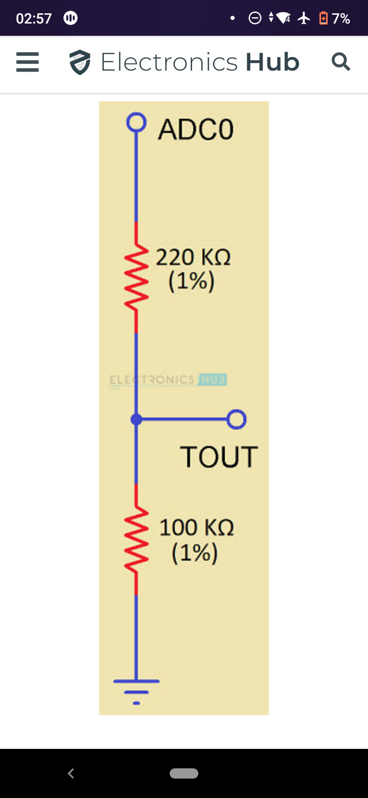
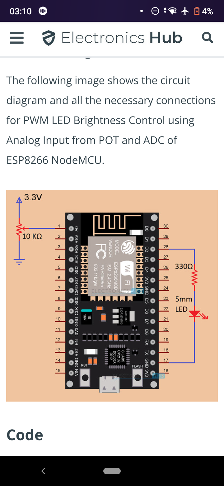
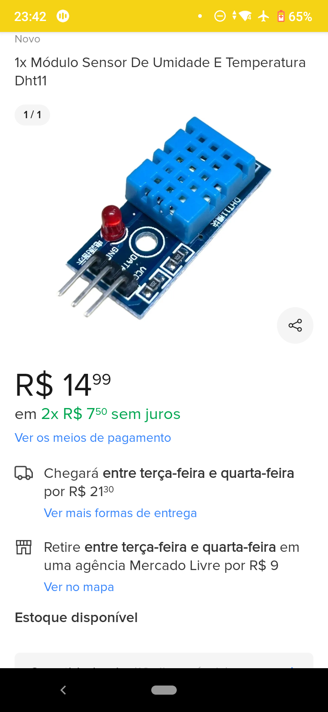
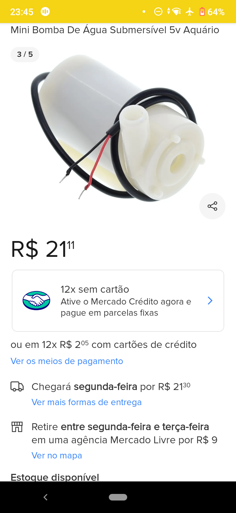
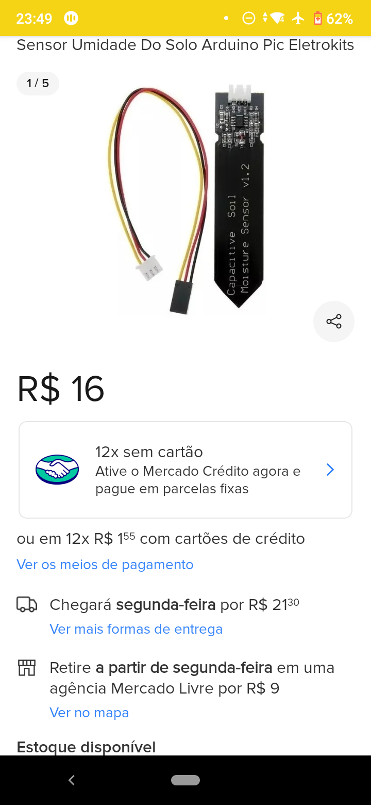
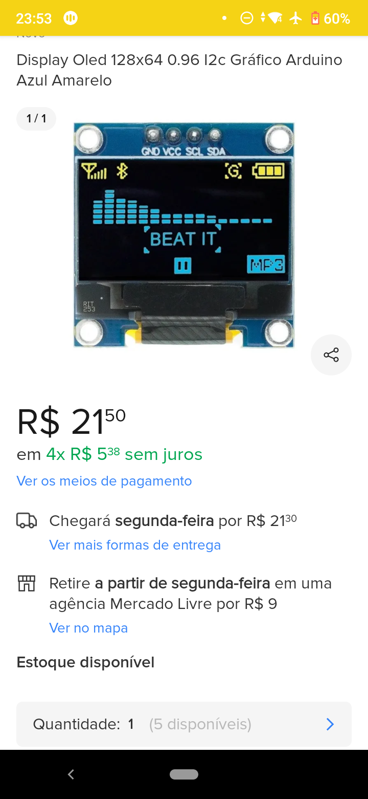

# Sistema IOT de irrigação e monitoramento agrícola

1. [Introduction](#introduction)
2. [Topic 1](#topic-1)

## Projetos fonte:

- https://thingsboard.io/docs/samples/esp8266/temperature/

- https://thingsboard.io/docs/user-guide/install/cluster/aws-self-hosted-setup/

- https://how2electronics.com/iot-smart-agriculture-automatic-irrigation-system-with-esp8266/#Bill_of_Materials

- https://circuitdigest.com/microcontroller-projects/iot-based-smart-irrigation-system-using-esp8266-and-soil-moisture-sensor

- https://www.hackster.io/devashish-gupta/capacitive-v-s-resistive-soil-moisture-sensor-e241f2

- https://www.electronicshub.org/nodemcu-esp8266-adc-tutorial/

----
## Introduction 

oiii

## Requisitos 

ADC 

LED Resistor

----

https://produto.mercadolivre.com.br/MLB-3107057574-1x-modulo-sensor-de-umidade-e-temperatura-dht11-_JM

----

https://produto.mercadolivre.com.br/MLB-2721582056-mini-bomba-de-agua-submersivel-5v-aquario-_JM

----

https://produto.mercadolivre.com.br/MLB-2643313690-sensor-umidade-do-solo-arduino-pic-eletrokits-_JM

----

### **Opcional** 

https://produto.mercadolivre.com.br/MLB-3092405256-display-oled-128x64-096-i2c-grafico-arduino-azul-amarelo-_JM

