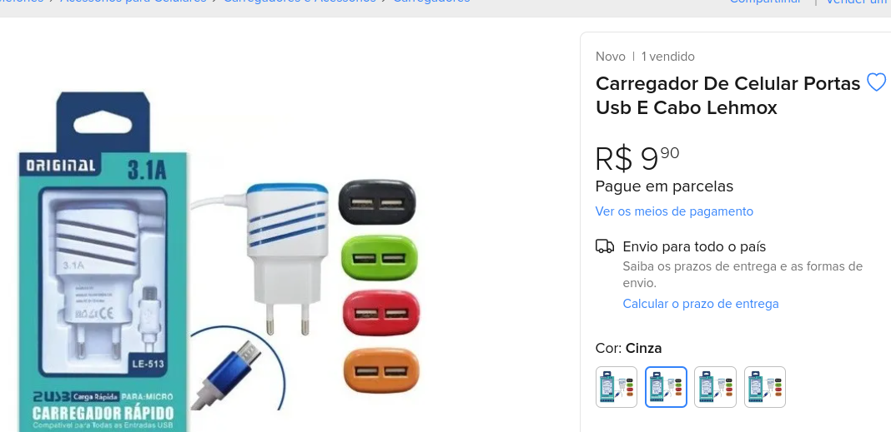
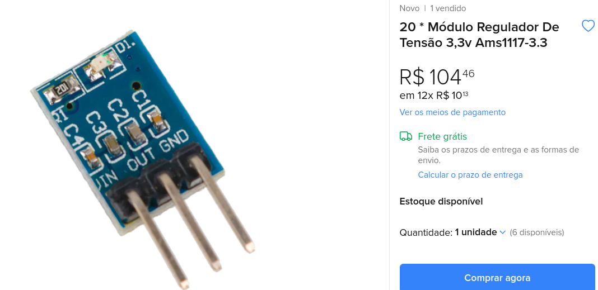
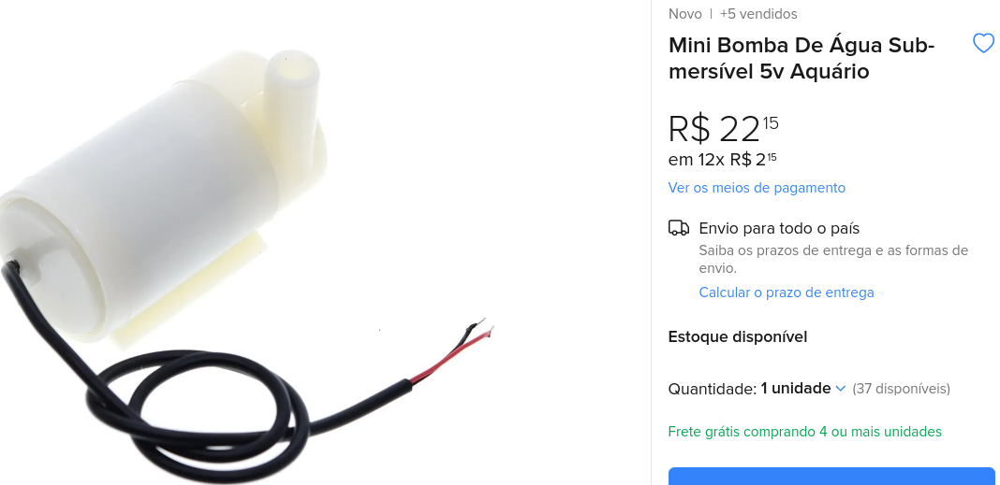
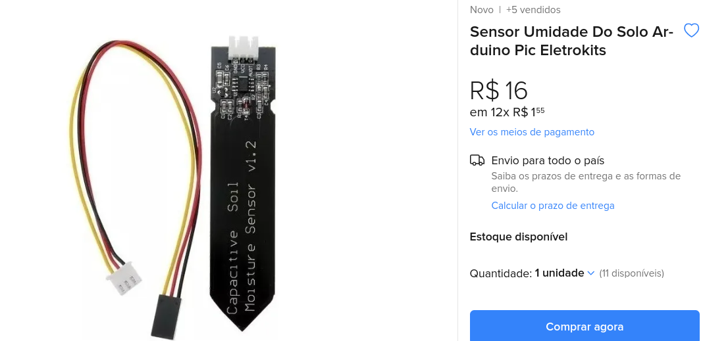
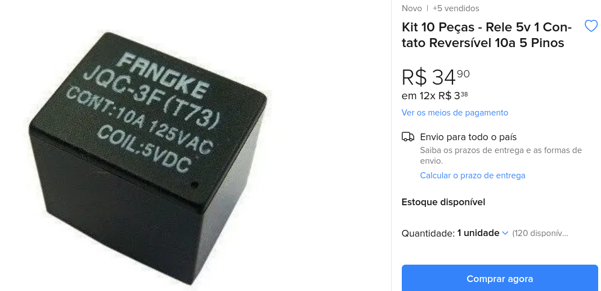
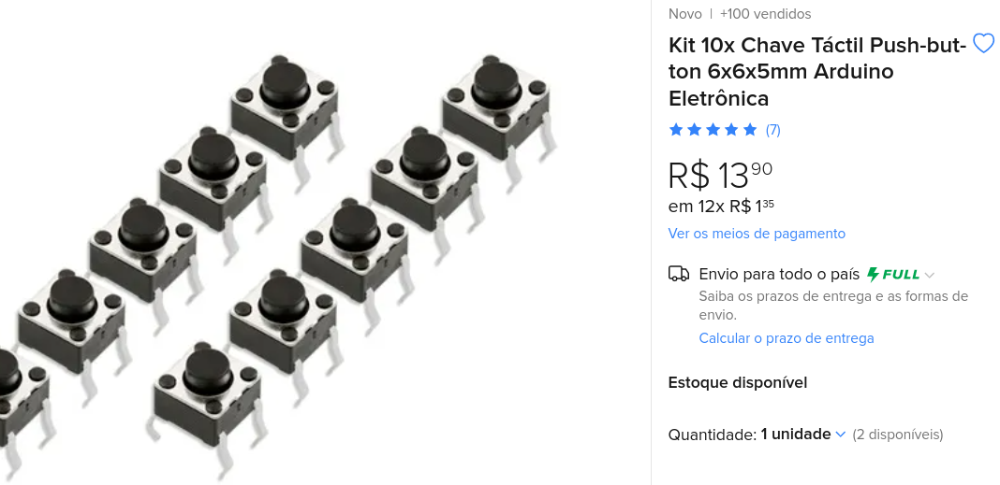
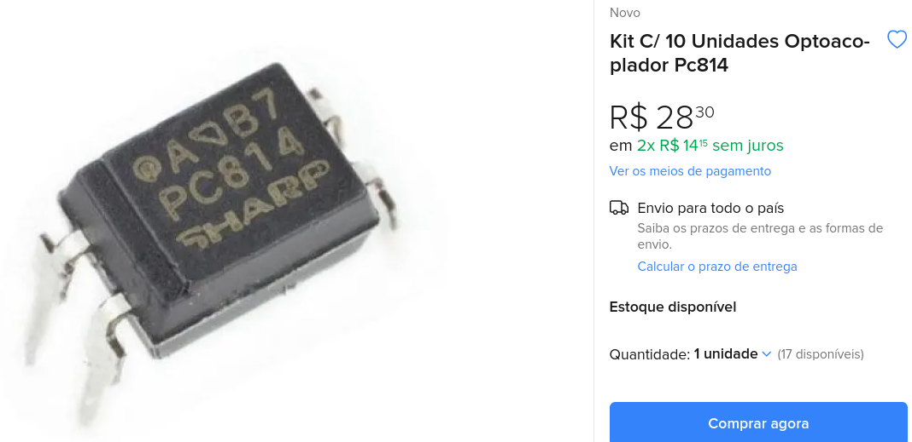
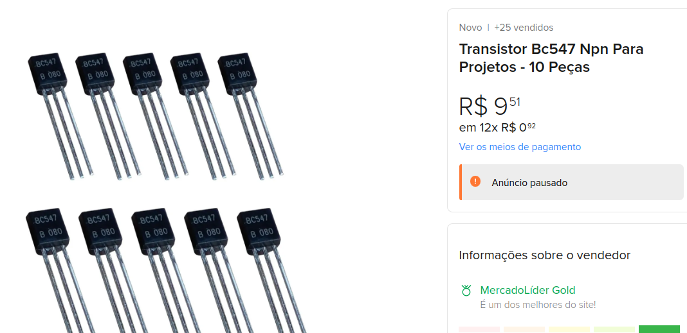
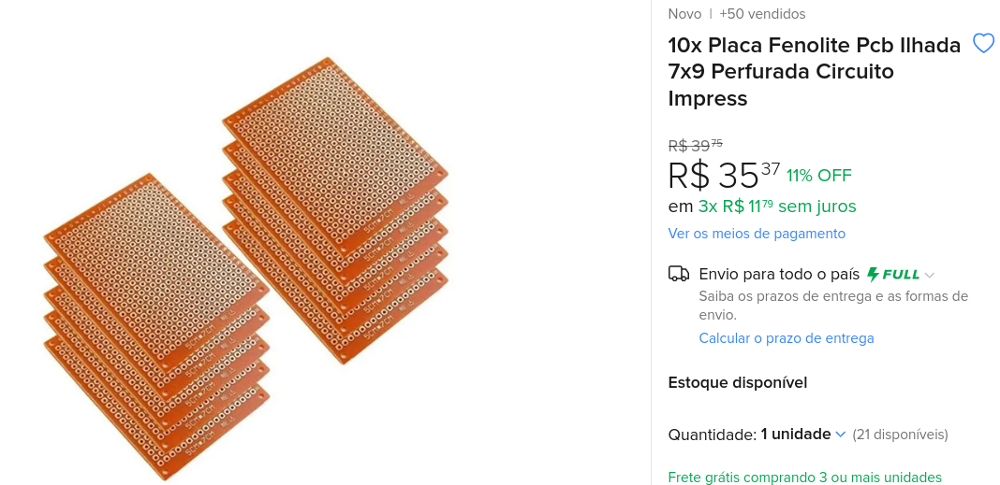

# 💦 Sistema IOT de irrigação e monitoramento agrícola

1. [Introduction](#🚪-Introduction)
2. [BOM - Bill of Materials](#📦-BOM-Bill-of-Materials)
3. [Cases](#📃-Cases)
4. [Images](#📸-Images)
5. [Optional](#☑-Optional) 

## 🚪 Introduction

Projeto destinado ao **controle** de humidade do solo e **monitoramento** da humidade relativa do ar e da temperatura em ambiente de cultivo agrícola. 

## 📦 BOM - Bill of Materials
 
| Material    | Price (R$)  | Obs.    |
|---|:---:|---|
| [esp8266-12e](https://produto.mercadolivre.com.br/MLB-1907050722-10x-modulo-wi-fi-esp8266-esp-12e-arduino-nota-fiscal-_JM#position=1&search_layout=stack&type=item&tracking_id=2d2e424e-874b-483e-bd6f-de6577e67ca7) | 13,30    | |
| [carregador 5v](https://produto.mercadolivre.com.br/MLB-2186040777-carregador-de-celular-portas-usb-e-cabo-lehmox-_JM#position=30&search_layout=stack&type=item&tracking_id=f5cff41b-8cd7-44a9-bb05-1a0c531d35b4) | 8,70 ||
| [regulador 3.3v](https://produto.mercadolivre.com.br/MLB-2807887210-20-modulo-regulador-de-tenso-33v-ams1117-33-_JM#position=7&search_layout=grid&type=item&tracking_id=11326d21-f718-4b99-b237-191f59bbc829) | 5,10 ||
| [sensor temperatura e humidade](https://produto.mercadolivre.com.br/MLB-3107057574-1x-modulo-sensor-de-umidade-e-temperatura-dht11-_JM)|24,40||
| [mini bomba](https://produto.mercadolivre.com.br/MLB-2721582056-mini-bomba-de-agua-submersivel-5v-aquario-_JM)|31,60||
| [sensor de solo](https://produto.mercadolivre.com.br/MLB-2643313690-sensor-umidade-do-solo-arduino-pic-eletrokits-_JM)|25,40||
| [relé 5v](https://produto.mercadolivre.com.br/MLB-1586973462-kit-10-pecas-rele-5v-1-contato-reversivel-10a-5-pinos-_JM#position=21&search_layout=grid&type=item&tracking_id=3d52d1e3-460d-42b3-8055-d38f81ec38c0)| 9,00 | 2 unidades |
| [push button](https://produto.mercadolivre.com.br/MLB-1858468268-kit-10x-chave-tactil-push-button-6x6x5mm-arduino-eletrnica-_JM#position=3&search_layout=stack&type=item&tracking_id=cbc63715-f20b-4715-b71f-ceae2e2f0b7b)| 2,40 ||
| [octoacoplador](https://produto.mercadolivre.com.br/MLB-2852866237-kit-c-10-unidades-optoacoplador-pc814-_JM#position=12&search_layout=stack&type=item&tracking_id=fec8b911-dba1-4467-82a2-fbf29e6434ed)| 12,00| 4 unidades ||
| [transistor bc337](https://produto.mercadolivre.com.br/MLB-2216562411-transistor-bc547-npn-para-projetos-10-pecas-_JM#position=3&search_layout=stack&type=item&tracking_id=7f7cbe23-53ea-4a31-b9f1-2a2b9964b7f1)|4,00|2 unidades|
| [PCB](https://produto.mercadolivre.com.br/MLB-1653387336-10x-placa-fenolite-pcb-ilhada-7x9-perfurada-circuito-impress-_JM#position=3&search_layout=grid&type=item&tracking_id=89f09f70-107e-462e-b941-97cc35200b74)| 4,60 ||
| **TOTAL** | **140,50** |  
  

## 📃 Cases

- https://thingsboard.io/docs/samples/esp8266/temperature/

- https://thingsboard.io/docs/user-guide/install/cluster/aws-self-hosted-setup/

- https://how2electronics.com/iot-smart-agriculture-automatic-irrigation-system-with-esp8266/#Bill_of_Materials

- https://circuitdigest.com/microcontroller-projects/iot-based-smart-irrigation-system-using-esp8266-and-soil-moisture-sensor

- https://www.hackster.io/devashish-gupta/capacitive-v-s-resistive-soil-moisture-sensor-e241f2

- https://www.electronicshub.org/nodemcu-esp8266-adc-tutorial/

## 📸 Images 

 

## ☑ Optional 

https://produto.mercadolivre.com.br/MLB-3092405256-display-oled-128x64-096-i2c-grafico-arduino-azul-amarelo-_JM

